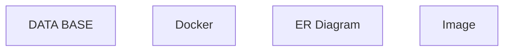

# Data_Base — Architecture

## 1. Stack
- Not a software project — no manifest found (checked package.json, go.mod, pyproject.toml, Cargo.toml: none present).
- Content types observed: SQL scripts (`.sql`), Docker Compose (`.yaml`), draw.io diagrams (`.drawio`), course slides/docs (`.pptx`, `.docx`, `.pdf`), images (`.png`).
- README.md (lines 44-46) lists prerequisites: Oracle XE or SQL-compatible DB, Docker + Docker Compose, draw.io.

## 2. Directory map
| path | what lives there |
|---|---|
| `DATA BASE/` | SQL scripts and course materials (README.md lines 18-26) |
| `DATA BASE/AIUB Course/` | Course slide decks (`1.pptx`–`8.pptx`) and lab docs (`.docx`) |
| `DATA BASE/Inturduction/` | Intro-to-databases screenshot |
| `DATA BASE/Oracle-XE/` | Oracle Express Edition setup materials |
| `DATA BASE/Task/` | SQL lab task PDF |
| `Docker/` | Docker cheat sheet and Compose file |
| `Docker/How to install mongo /` | `MongoDB.yaml` Compose file |
| `ER Diagram/` | draw.io ER diagram practice files |
| `ER Diagram/Draw With Questions/` | `Cricket Club DataBase.drawio`, `Ecommarce.drawio` |
| `Image/` | Repo image asset (`image1.png`) |

## 3. Diagram

No cross-folder references were found in the files read (README.md); folders are independent content sections.

## 4. Component index
- [[DATA BASE]]
- [[Docker]]
- [[ER Diagram]]
- [[Image]]

## 5. Entry points
- No dev/prod build — this is a static learning-material repo (no manifest, no `main.*`/`index.*`/`app.*` found at root, `src/`, or `app/`).
- Usage entry points (README.md lines 54-60):
  - `DATA BASE/HR.sql` — load into a SQL-compatible database and run.
  - `Docker/How to install mongo /MongoDB.yaml` — `docker compose -f MongoDB.yaml up`.
  - `ER Diagram/Draw With Questions/*.drawio` — open at app.diagrams.net or VS Code Draw.io extension.

## 6. Conventions
- Top-level folder names use Title Case, some with spaces (`DATA BASE`, `ER Diagram`).
- Docker Compose file is named `MongoDB.yaml` (capitalized, `.yaml` extension, not `.yml`).
- README.md documents every top-level folder as a table of resource → description (README.md lines 9-14, 20-26, 30-31, 35-38).

## 7. Where things go
- Add a new SQL practice script → `DATA BASE/` (alongside `HR.sql`); add a row to the README.md "DATA BASE" table.
- Add a new ER diagram → `ER Diagram/Draw With Questions/*.drawio`; add a row to the README.md "ER Diagram" table.
- Add a new Docker service → `Docker/` as a Compose YAML file; document it in `Docker/Docker.md` and README.md "Docker" section.
- Add new course material → `DATA BASE/AIUB Course/`; update README.md if it should be listed.
- Add a new supporting image → `Image/`.
